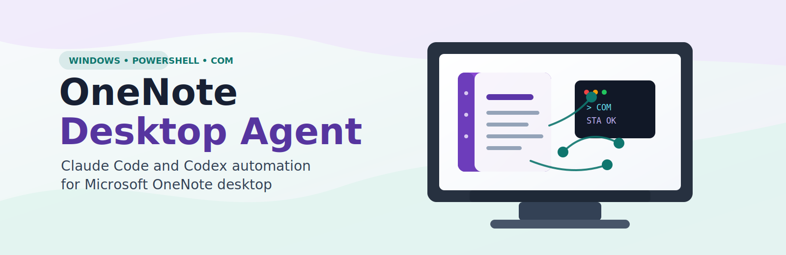

<p align="center">
  
</p>

# OneNote Desktop Agent

**OneNote Desktop Agent** is a Claude Code plugin and Codex plugin for automating Microsoft OneNote desktop on Windows through Windows PowerShell and the OneNote COM API.

Use it when an AI coding agent needs local OneNote desktop automation: inspect OneNote installation state, list notebooks, sections, and pages, read OneNote page XML, create or update pages, navigate the OneNote desktop app, export pages to PDF or other formats, search notebooks, and extract embedded audio or media files when OneNote exposes media paths.

This project targets **Microsoft OneNote desktop for Windows**, not OneNote for the web, Microsoft Graph, or Office.js add-ins.

## Why This Exists

Most OneNote automation paths assume cloud APIs, browser automation, or add-ins. OneNote Desktop Agent gives Claude Code and Codex a local, scriptable path into the desktop app by documenting the COM surface and wrapping common operations in PowerShell helpers.

The stable plugin and skill name is `onenote-desktop`. The public repository name is `onenote-desktop-agent`.

## Features

- Check whether Microsoft OneNote desktop and COM automation are available.
- List visible notebooks, sections, section groups, and pages.
- Read raw OneNote page XML with parsed page and object IDs.
- Create pages and write basic page content.
- Update page XML while preserving OneNote namespaces and IDs.
- Search pages and metadata through the OneNote COM API.
- Navigate OneNote desktop to a page, section, or object.
- Export notebooks, sections, or pages to PDF, XPS, Word, MHTML, EMF, `.one`, or `.onepkg`.
- Extract embedded media or audio recordings from `MediaFile` page XML entries.
- Probe likely OneNote local storage and cache locations read-only for troubleshooting.

## Requirements

- Windows.
- Microsoft OneNote desktop with COM automation available.
- Windows PowerShell via `powershell.exe`.
- Claude Code or Codex if installing as an agent plugin.

OneNote COM calls should run under single-threaded apartment PowerShell:

```powershell
powershell.exe -NoProfile -STA -ExecutionPolicy Bypass -File .\skills\onenote-desktop\scripts\Invoke-OneNoteCom.ps1 -Operation check-install
```

## Install In Claude Code

After this repository is published at `takhoffman/onenote-desktop-agent`, install it as a Claude Code plugin:

```powershell
claude plugin marketplace add takhoffman/onenote-desktop-agent
claude plugin install onenote-desktop@takhoffman
```

For local testing from the repository root:

```powershell
claude plugin install .
```

Start a fresh Claude Code session and test:

```text
Use the onenote-desktop skill to check my OneNote desktop COM install.
```

## Install In Codex

After publishing this repository to GitHub, install it with the Codex CLI:

```powershell
codex plugin marketplace add https://github.com/takhoffman/onenote-desktop-agent
codex plugin add onenote-desktop@onenote-desktop-agent
```

For Codex Desktop, open Plugins, add the marketplace URL, then install `onenote-desktop`:

```text
https://github.com/takhoffman/onenote-desktop-agent
```

For local Codex Desktop testing, install the committed package into the personal plugin cache and restart Codex if needed:

```powershell
$target = "$env:USERPROFILE\.codex\plugins\cache\personal\onenote-desktop\0.1.0"
New-Item -ItemType Directory -Force -Path $target | Out-Null
git archive --format=tar HEAD | tar -x -C $target
```

In a new Codex session, ask:

```text
Use the onenote-desktop skill to list my visible OneNote notebooks.
```

## Direct PowerShell Usage

You can also run the helper script without Claude Code or Codex.

Check OneNote desktop and COM:

```powershell
powershell.exe -NoProfile -STA -ExecutionPolicy Bypass -File .\skills\onenote-desktop\scripts\Invoke-OneNoteCom.ps1 -Operation check-install
```

List visible notebooks, sections, and pages:

```powershell
powershell.exe -NoProfile -STA -ExecutionPolicy Bypass -File .\skills\onenote-desktop\scripts\Invoke-OneNoteCom.ps1 -Operation hierarchy -Scope pages
```

Read a page:

```powershell
powershell.exe -NoProfile -STA -ExecutionPolicy Bypass -File .\skills\onenote-desktop\scripts\Invoke-OneNoteCom.ps1 -Operation get-page -PageId "<page-id>"
```

Create a page:

```powershell
powershell.exe -NoProfile -STA -ExecutionPolicy Bypass -File .\skills\onenote-desktop\scripts\Invoke-OneNoteCom.ps1 -Operation create-page -SectionId "<section-id>" -Title "Agent note" -Text "Written through OneNote COM."
```

Export a page to PDF:

```powershell
powershell.exe -NoProfile -STA -ExecutionPolicy Bypass -File .\skills\onenote-desktop\scripts\Invoke-OneNoteCom.ps1 -Operation publish -PageId "<page-id>" -TargetPath ".\exports\page.pdf" -PublishFormat pdf
```

Extract embedded media from a page:

```powershell
powershell.exe -NoProfile -STA -ExecutionPolicy Bypass -File .\skills\onenote-desktop\scripts\Invoke-OneNoteCom.ps1 -Operation extract-media -PageId "<page-id>" -OutputDir ".\media-export"
```

## Package Layout

- `.claude-plugin/plugin.json`: Claude Code plugin manifest.
- `.claude-plugin/marketplace.json`: Claude Code marketplace descriptor.
- `.codex-plugin/plugin.json`: Codex plugin manifest.
- `skills/onenote-desktop/SKILL.md`: shared skill instructions for Claude Code and Codex.
- `skills/onenote-desktop/scripts/Invoke-OneNoteCom.ps1`: main OneNote COM helper.
- `skills/onenote-desktop/scripts/Probe-OneNoteCom.ps1`: COM method and enum probe.
- `skills/onenote-desktop/scripts/Probe-OneNoteStorage.ps1`: read-only OneNote storage/cache inventory probe.
- `skills/onenote-desktop/references/`: implementation notes for raw COM, page XML, media extraction, and storage boundaries.

## Safety And Privacy

OneNote Desktop Agent runs locally and does not require a localhost server, browser automation, Microsoft Graph, or an Office.js add-in.

Runtime output can include private notebook names, page IDs, local file paths, note text, exported documents, and extracted media. This repository ignores built packages, probe output, OneNote section files, exported documents, and media output so private notebook data is not staged accidentally.

The storage probe is read-only. Normal automation should prefer OneNote COM and page XML over raw cache or `.one` file inspection.

For page edits, read existing XML first, preserve namespaces and IDs, update only the intended content, then read the page again to verify.

## Search Keywords

Microsoft OneNote desktop automation, OneNote COM API, OneNote PowerShell automation, Claude Code plugin, Codex plugin, OneNote page XML, local OneNote automation, Windows OneNote scripting, export OneNote to PDF, extract OneNote audio recordings.

## Status

This is an early public package. The helper scripts cover common non-destructive OneNote COM operations; destructive operations such as deleting notebooks, sections, pages, or page content are intentionally not wrapped as default workflows.

## License

MIT License. See `LICENSE`.
